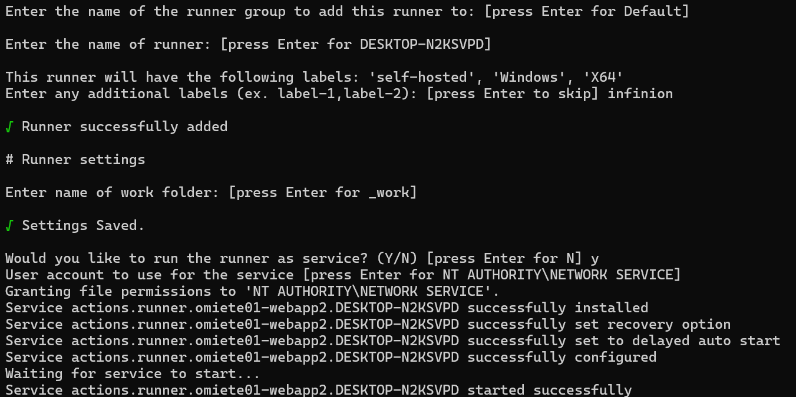
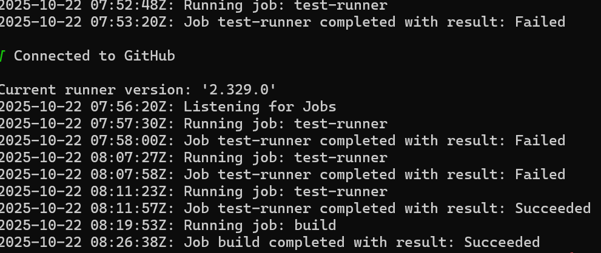
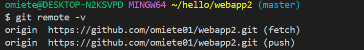

# 🛠️ Self-Hosted GitHub Actions Runner Setup

This guide documents the process of setting up a self-hosted GitHub Actions runner on a local Windows PC and successfully running a test pipeline.

---

## Task Overview

- Goal: Set up a self-hosted GitHub Actions runner on a local machine.
- Bonus: Run a test workflow using the self-hosted runner.

---

## Environment

- **OS:** Windows 11
- **GitHub Repository:** [omiete01/webapp2](https://github.com/omiete01/webapp2)
- **Runner Type:** Self-hosted

---

## Setup Steps

### 1. Register the Runner

1. Go to your GitHub repo → **Settings** → **Actions** → **Runners**
2. Click **New self-hosted runner**
3. Choose your OS and follow the instructions to install the runner on your local machine


### 2. Start the Runner

```powershell
./run.cmd
```

The runner will now listen for jobs from GitHub.

---

## Test Workflow

Created a simple workflow to verify the runner:

### `.github/workflows/docker-image.yml`

```yaml
name: Test Self-Hosted Runner

on:
  push:
    branches:
      - master
  workflow_dispatch:

jobs:
  test-runner:
    runs-on: self-hosted
    steps:
      - name: Checkout repository
        uses: actions/checkout@v3

      - name: Print runner info
        shell: powershell
        run: |
          Write-Host "Self-hosted runner is working!"
          Write-Host "Hostname: $env:COMPUTERNAME"
          Write-Host "Username: $env:USERNAME"
          Write-Host "Current directory: $(Get-Location)"

      - name: List files in repo
        shell: powershell
        run: |
          Get-ChildItem -Recurse

      - name: Simulate build step
        shell: powershell
        run: Write-Host "Running build simulation..."
```

Note: this is used to test the workflow from a windows system where the runner is installed.

---

## Result

- The workflow executed successfully on the self-hosted runner.
- Verified runner info and file listing and confirmed build simulation step.
- I eventually used the workflow from my previous repo [omiete01/webapp](https://github.com/omiete01/webapp) which included a python webapp running in a docker container being pushed as an image to dockerhub.
- The workflow executed succesfully on the self-hosted runner and the image was uploaded automatically to my docker repository


---

## Feedback

### Challenges

1. I encountered an SSH-specific error - `Host key verification` failed during `git fetch` in the self-hosted runner. This showed that Git was using SSH despite HTTPS remote URLs.
I also experienced conflicting Git URL rewriting rules. Running `git config --global --get-regexp url` revealed mutually contradictory rules:
  
```bash
url.git@github.com:.insteadof https://github.com/
url.”git@github.com:”.insteadof “https://github.com/”
url.https://github.com/.insteadof git@github.com:
url.https://.insteadof git://
```

These caused unpredictable Git behavior, likely forcing SSH usage even when HTTPS was intended.

2. I also had compatibility issues with PowerShell syntax and Shell in GitHub Actions. When testing the self-hosted runner with a diagnostic workflow, I used the echo command which failed with a parsing error due to improper string handling in powershell.

### Resolution

1. I diagnosed the issue via `git remote -v` and `git config --get-regexp url`. After finding the conflicting URL rewrite rules, I removed them using the below command ensuring clean HTTPS usage:

```bash
git config --global --unset url."git@github.com:".insteadof
git config --global --unset url.https://github.com/.insteadof
```


2. I corrected the PowerShell scripting in shell by replacing `echo` with `Write-Host` for reliable output in PowerShell, using proper PowerShell string interpolation:

```powershell
Write-Host "Current directory: $(Get-Location)"
```

### What I would do differently in a Production Environment

- I would use dedicated, ephemeral runners instead of long-lived self-hosted runners to reduce security risk and configuration drift
- I would store Docker Hub credential in GitHub environment variables and scope them to specific environments eg production.
- I would also avoid hardcoding image tags and use semantic versioning or Git SHA-based tags for traceability and reproducibility
- I would also implement monitoring and integrate slack, teams and email notifications to detect and respond to pipeline issues quickly.
  
### Security Considerations Implemented

1. **GitHub Workflow:** 
   - I managed secrets using secrets.DOCKERHUB_NAME and secrets.DOCKERHUB_TOKEN to authenticate securely with DockerHub. 
   - The workflow also only runs on push to the master branch, reducing exposure to untrusted code changes.
2. **Others:** 
   - I used a minimal base image with python:3.11-alpine, which is lighweight and has a smaller attack surface compared to full OS images.
   - In Dockerignore file, I excluded __pycache__/, *.pyc, *.log, and env/, which helps prevent unnecessary or sensitive files from being added into the Docker image.
   - Using --no-cache with apk and --no-cache-dir with pip helps prevent leftover package data that could be exploited.

